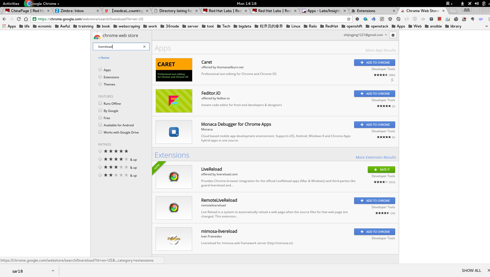
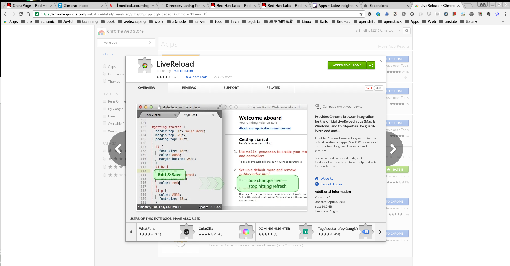
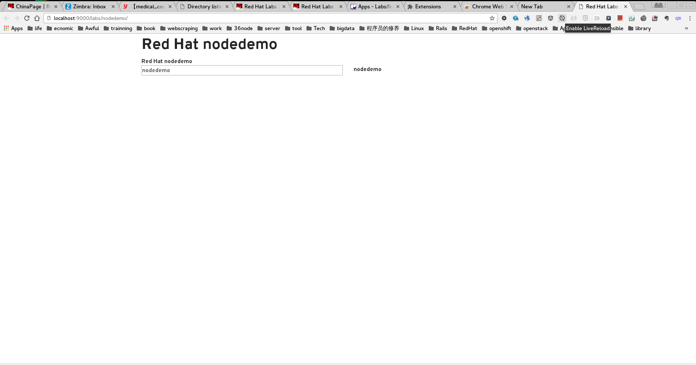
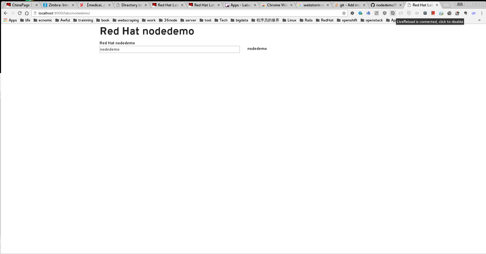

## Local Development

1. Setup [accessproxy](https://github.com/redhataccess/accessproxy).
2. In a terminal start the proxy with `accessproxy`
3. In another terminal navigate to your apps directory and run the following commands
  - `npm install && bower install`
  - Start the project by either way
    - `grunt serve` to start the redirect url
    - `grunt serve --gruntfile Gruntfile_dev.js` to start the localhost url http://localhost:9000/labs/nodedemo
4. (Optional) Enable livereload, only for `grunt serve --gruntfile Gruntfile_dev.js`
    Install the livereload extension in Chrome extension market.
    Open the http://localhost:9000/labs/nodedemo, and click the icon of livereload extension. **Then when you change the code, the web page is auto refresh**. Refer to the following snapshot.
    
    
    Open the extension marget page: 
    
    
    
    
    Search livereload and check the details: 
    
    
    
    
    After installation, you will see livereload icon: 
    
    
    
    
    Open http://localhost:9000/labs/nodedemo, click the livereload icon to enable it: 
    
    
    Then when you change the code, the web page is auto refresh.